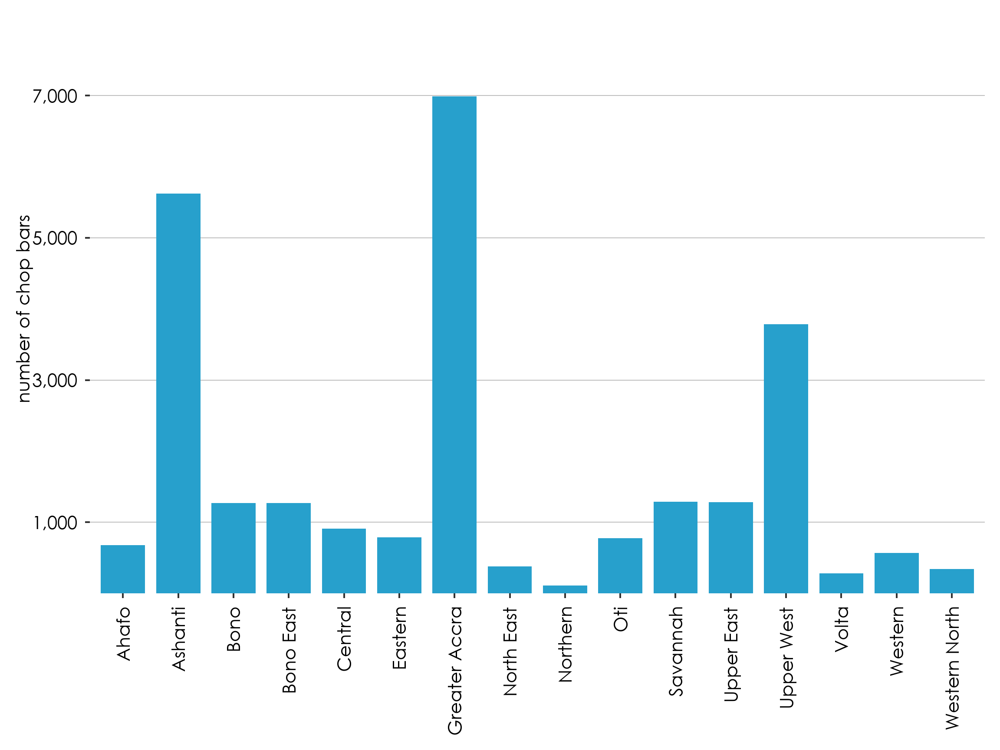

# Statistical Bulletins

## 1.  STATISTICAL BULLETINS

The purpose of bulletins is to present statistics on a specific subject: e.g., labour statistics or Consumer Price Inflation. The target audience for these briefs is policy makers, civil society organisations, and development partners.

Bulletins should be used for statistics that are released routinely: e.g., monthly, quarterly or biannually. The bulletins should present a core set of indicators that can be tracked over time. Additional statistics highlighting patterns or trends of policy relevance can be added as needed.

&#x20;

1.1.      Format of Bulletins

Bulletins should include the elements outlined below:

1\.    Background – the section should succinctly provide the importance of the statistics in the bulletin, highlight relevant policy frameworks, and preview the contents of the bulletin.

2\.    Highlights – this section should present the statistics in charts with the highlights written underneath the chart as illustrated below:

<figure><figcaption></figcaption></figure>

3\.    Concepts and definitions (if applicable) – concepts and indicators presented in the highlights that require definitions should be explained in this section; and presented in alphabetical order.

4\.    Link to access detailed tables (if applicable) – if there are detailed tables, a link and QR code to access them must be provided in this section. Bulletins should not have detailed tables or an appendix.

Bulletins should be formatted according to font, paragraph and spacing guidelines used for all other publications.

&#x20;

### 1.2.      Length of Bulletins

The recommended length of statistics bulletins is 25 to 35 pages.&#x20;
